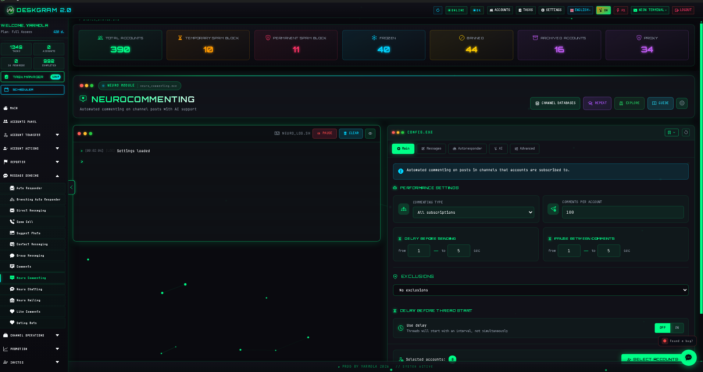
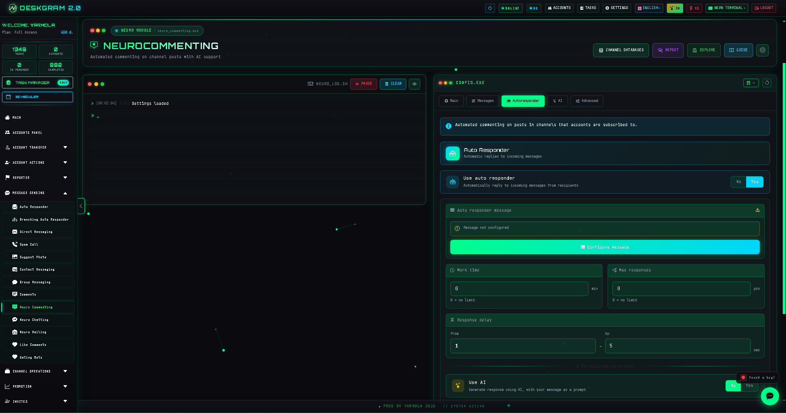
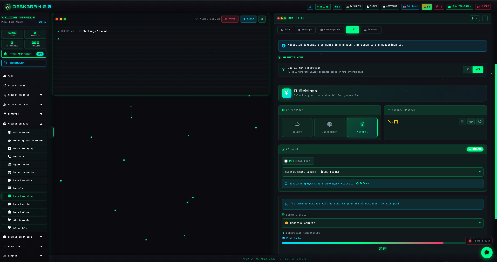
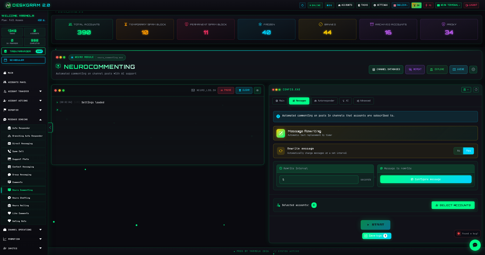

# AI Telegram Commenting with Deskgram 2

Neuro Commenting is a Deskgram 2 module for automatic commenting on new Telegram channel posts. It combines post monitoring, template-based comments, AI-generated variations, limits, delays, discussion entry, and optional reply handling.

[Deskgram 2 Hub](https://github.com/Deskgram-2/deskgram-2-telegram-automation-en) · [Website](https://deskgram2.com/) · [Telegram Bot](https://t.me/DG2welcomebot) · [Web Preview](https://deskgram2.com/web-preview)

## About the module

| Parameter | What is inside |
|---|---|
| Main task | Commenting on new Telegram channel posts |
| Text source | Template, rewrite mode, or AI based on post content |
| Useful for | Telegram marketing, warmup activity, post engagement |
| Important settings | Comment type, limits, delays, discussions, autoresponder |
| Related modules | Direct Messaging, Audience Parser, Neuro Mailing |

## What it can do

- monitor new posts in Telegram channels;
- work across all subscriptions or a selected list of channels;
- generate comments from templates or AI;
- vary the text before sending;
- join discussion chats automatically when needed;
- connect an autoresponder for follow-up replies;
- keep execution logs and statistics.

## Quick start

1. Choose the working mode: all subscriptions or a custom channel list.
2. Set limits, delays, and exclusions.
3. Pick the text mode: template, rewrite, or AI.
4. Enable discussion handling or autoresponder logic if needed.
5. Assign accounts and start the task.

## Useful combinations around this module

- [Account Manager](https://github.com/Deskgram-2/telegram-account-manager-deskgram-en) if you need to prepare the working account grid first.
- [Automation Settings](https://github.com/Deskgram-2/telegram-automation-settings-deskgram-en) if the scenario depends on AI providers and shared system parameters.
- [Direct Messaging](https://github.com/Deskgram-2/telegram-direct-messaging-deskgram-en) if comments should become follow-up conversations.
- [Audience Parser](https://github.com/Deskgram-2/telegram-audience-parser-deskgram-en) if you also build a collection layer for the next workflows.

## What this execution path often connects to next

- [Task Manager](https://github.com/Deskgram-2/telegram-task-manager-deskgram-en) if you want centralized control over errors and progress.
- [Join Groups](https://github.com/Deskgram-2/telegram-join-groups-deskgram-en) if the account environment should be prepared before or alongside commenting.
- [Invite Tool](https://github.com/Deskgram-2/telegram-invite-tool-deskgram-en) if commenting is part of a broader growth chain built around prepared communities.
- [Proxy Manager](https://github.com/Deskgram-2/telegram-proxy-manager-deskgram-en) if execution stability depends on the infrastructure layer.

## Interface highlights

### Comment builder

### AI settings

### Statistics

## When it is especially useful

- when you need structured commenting under newly published posts;
- when AI-based text variety matters more than repeating one static template;
- when you want limits and pacing inside one visible workflow;
- when commenting is only the first layer before further dialog handling.

## Why it is more convenient than a manual flow

| Manual approach | Neuro Commenting in Deskgram 2 |
|---|---|
| You must constantly watch new posts | The module tracks publication flow for you |
| Comments become repetitive quickly | AI and rewrite logic add variation |
| It is hard to maintain pacing and limits | Limits and delays are configured in the interface |
| Scaling across many accounts is messy | The workflow is designed for account grids |
| Follow-up replies are easy to lose | Autoresponder logic can extend the scenario |

## Related repositories

- [Deskgram 2 Hub](https://github.com/Deskgram-2/deskgram-2-telegram-automation-en)
- [Direct Messaging](https://github.com/Deskgram-2/telegram-direct-messaging-deskgram-en)
- [Audience Parser](https://github.com/Deskgram-2/telegram-audience-parser-deskgram-en)
- [Account Manager](https://github.com/Deskgram-2/telegram-account-manager-deskgram-en)
- [Automation Settings](https://github.com/Deskgram-2/telegram-automation-settings-deskgram-en)
- [Task Manager](https://github.com/Deskgram-2/telegram-task-manager-deskgram-en)
- [Join Groups](https://github.com/Deskgram-2/telegram-join-groups-deskgram-en)
- [Invite Tool](https://github.com/Deskgram-2/telegram-invite-tool-deskgram-en)
- [Proxy Manager](https://github.com/Deskgram-2/telegram-proxy-manager-deskgram-en)

## FAQ

### Is AI required?

No. You can work with a plain template-based flow. AI is an optional layer for better variation and context.

### Can I target only selected channels?

Yes. The module supports working from a predefined channel list.
